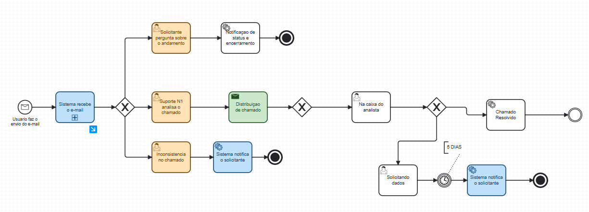

  
  
<strong>Sistema de Gestão de Chamados</strong>

  
Projeto desenvolvido na disciplina de Engenharia de Software - IFMT Campus Cuiabá

  

    
    
    
    
    
  

---

## Sumário

- [Visão do Produto](#-visão-do-produto)
- [Descrição do Projeto](#-descrição-do-projeto)
- [Stack Tecnológica](#-stack-tecnológica)
- [Arquitetura do Sistema](#-arquitetura-do-sistema)
- [Deploy e Infraestrutura](#-deploy-e-infraestrutura)
- [Instalação e Execução](#-instalação-e-execução)
- [Documentação](#-documentação)
- [Contribuição](#-contribuição)

---

## Visão do Produto

O **Call Me** é um sistema web de gestão de chamados desenvolvido como projeto acadêmico da disciplina de Engenharia de Software. O sistema foi projetado para centralizar, organizar e otimizar o atendimento de solicitações em ambientes como suporte técnico, atendimento ao cliente e serviços internos.

A plataforma automatiza o registro, acompanhamento e resolução estruturada de chamados, promovendo maior agilidade no atendimento, rastreabilidade das interações e transparência nos processos. Por meio de uma interface intuitiva e recursos como notificações automáticas e controle de acesso baseado em papéis, o Call Me melhora significativamente a comunicação entre usuários e administradores.

---

## Descrição do Projeto

### Contexto e Problemática
Muitas empresas e instituições enfrentam dificuldades na gestão eficiente de chamados de suporte técnico, resultando em atrasos no atendimento e falta de controle sobre solicitações. Este projeto visa desenvolver um sistema que automatize a criação, organização e acompanhamento de chamados, incluindo integração com e-mail para abertura automática de tickets.

### Público-Alvo
- **Primário:** SEMAS (Secretaria Municipal de Meio Ambiente e Sustentabilidade)
- **Secundário:** Instituições públicas e privadas que necessitam de um sistema automatizado para registro e acompanhamento de chamados

### Justificativa Técnica
A falta de um sistema estruturado pode levar a falhas na comunicação e na resolução de problemas técnicos. O desenvolvimento deste projeto como atividade acadêmica permite a aplicação prática de conceitos de Engenharia de Software, beneficiando tanto a formação acadêmica quanto a criação de uma solução real para problemas organizacionais.

---

## Stack Tecnológica

### Backend (Java/Spring Boot)
| Tecnologia | Versão | Finalidade |
|------------|--------|------------|
| **Java** | 21 LTS | Linguagem principal do backend |
| **Spring Boot** | 3.3.5 | Framework principal para desenvolvimento |
| **Spring Security** | 6.x | Autenticação e autorização (JWT, OAuth2) |
| **Spring Data JPA** | 3.x | Persistência e mapeamento objeto-relacional |
| **Spring Boot Mail** | 3.x | Envio de e-mails (ex: redefinição de senha) |
| **java-jwt (Auth0)** | 4.4.0 | Geração e validação de tokens JWT |
| **SpringDoc OpenAPI** | 2.1.0 | Documentação de API (Swagger UI) |
| **PostgreSQL Driver** | 42.x | Conectividade com banco de dados |
| **Testcontainers** | 1.19.3 | Testes de integração com containers Docker |
| **Dotenv-java** | 3.0.0 | Carregamento de variáveis de ambiente |
| **Lombok** | - | Redução de código boilerplate |
| **Maven** | 3.x | Gerenciamento de dependências |

### Frontend (Angular/TypeScript)
| Tecnologia | Versão | Finalidade |
|------------|--------|------------|
| **Angular** | 17.3.0 | Framework principal do frontend |
| **TypeScript** | 5.4.2 | Linguagem principal |
| **Angular CLI** | 17.3.15 | Interface de linha de comando para desenvolvimento |
| **Angular Router** | 17.3.0 | Roteamento SPA |
| **Angular Forms** | 17.3.0 | Formulários reativos |
| **Angular Animations** | 17.3.0 | Animações e transições |
| **RxJS** | 7.8.0 | Programação reativa |
| **Zone.js** | 0.14.3 | Detecção de mudanças assíncronas |
| **NGX-Toastr** | 19.0.0 | Notificações toast |
| **SCSS** | - | Estilização avançada |
| **Jasmine** | 5.1.0 | Framework de testes unitários |
| **Karma** | 6.4.0 | Test runner para execução de testes |
| **Nginx** | Latest | Servidor web para servir aplicação em produção |

### Banco de Dados
| Tecnologia | Versão | Finalidade |
|------------|--------|------------|
| **PostgreSQL** | 17.4 Alpine | Banco de dados principal |
| **pgAdmin** | 4.x | Interface gráfica para administração (desenvolvimento) |

### DevOps e Infraestrutura
| Tecnologia | Versão | Finalidade |
|------------|--------|------------|
| **Docker** | Latest | Containerização de aplicações |
| **Docker Compose** | v2 | Orquestração local de containers (desenvolvimento) |
| **Kubernetes** | 1.x | Orquestração em produção |
| **GitHub Actions** | - | CI/CD e automação |
| **Git** | Latest | Controle de versão |

---

## Arquitetura do Sistema

O projeto adota uma **arquitetura de microsserviços containerizada** com separação clara de responsabilidades:

- **Frontend (SPA):** Aplicação Angular servindo interface do usuário
- **Backend (API REST):** Aplicação Spring Boot com lógica de negócio
- **Banco de Dados:** PostgreSQL para persistência
- **Infraestrutura:** Docker para desenvolvimento, Kubernetes para produção

**Padrões Arquiteturais Implementados:**
- Model-View-Controller (MVC) no backend
- Component-Based Architecture no frontend
- Repository Pattern para acesso a dados
- Dependency Injection em ambas as camadas
- REST API para comunicação entre frontend e backend

---

## Diagrama BPMN do Sistema

O fluxo principal de atendimento de chamados do sistema foi modelado utilizando BPMN, proporcionando uma visão clara e padronizada dos processos de negócio.

Abaixo está o diagrama BPMN que representa o fluxo de abertura, acompanhamento e resolução de chamados:

  

O diagrama detalha as etapas desde a abertura do chamado pelo usuário, passando pela triagem, atendimento técnico e encerramento, facilitando o entendimento e a comunicação entre as equipes envolvidas no desenvolvimento e operação do sistema.

---

## Deploy e Infraestrutura

O projeto foi planejado com **três estratégias distintas de deploy** para diferentes cenários. Abaixo, apresentamos as estratégias, suas vantagens e desvantagens:

### 1. AWS com Terraform (Produção Cloud)

| Componente                | Descrição                          |
|---------------------------|------------------------------------|
| **EC2 Instances**         | Backend (Spring Boot)             |
| **RDS PostgreSQL**        | Banco de dados gerenciado         |
| **S3 + CloudFront**       | Frontend (Angular) - Distribuição estática |
| **Application Load Balancer** | Distribuição de carga          |
| **Route 53**              | DNS e roteamento                  |

**Vantagens:**
- Estratégia mais profissional e amplamente utilizada no mercado.
- Alta escalabilidade e confiabilidade.
- Serviços gerenciados reduzem a complexidade operacional.

**Desvantagens:**
- Alto custo, tornando-se inviável a longo prazo.
- Infraestrutura foi criada, mas não utilizada devido aos custos.

---

### 2. Docker Swarm + Portainer + GitHub Actions (Produção Self-Hosted)

| Componente                | Descrição                          |
|---------------------------|------------------------------------|
| **Docker Swarm Cluster**  | Orquestração de containers         |
| **Portainer**             | Interface gráfica de gerenciamento |
| **GitHub Actions**        | CI/CD automatizado                |
| **Traefik**               | Proxy reverso e balanceamento     |
| **Docker Registry**       | Armazenamento de imagens          |

**Vantagens:**
- Simplicidade na configuração e gerenciamento.
- Integração com GitHub Actions para automação de deploys.

**Desvantagens:**
- Ainda não testado, pontos positivos e negativos não foram completamente avaliados.

---

### 3. Hostinger KVM + K3s (Kubernetes Lightweight)

Esta foi considerada inicialmente como a principal estratégia de deploy. Realizamos testes locais utilizando Minikube e chegamos a criar arquivos YAML de configuração para Kubernetes, adaptando os serviços do Docker Compose. No entanto, ao migrar para um ambiente real (Hostinger KVM com K3s), identificamos limitações práticas que inviabilizaram o uso de Kubernetes neste contexto acadêmico.

**Pontos observados:**

- **Ambiente single-node não simula produção real:**  
  Rodar K3s em uma única VM elimina os principais benefícios do Kubernetes, como alta disponibilidade e escalabilidade horizontal. Na prática, o cluster se comporta como um servidor tradicional, sem tolerância a falhas.

- **Diferenças de rede e storage:**  
  O comportamento de CNI (NGINX), provisionamento de volumes e Ingress em ambiente single-node é diferente do observado em clusters multi-node, tornando os testes pouco representativos para cenários reais de produção.

- **Complexidade operacional desnecessária:**  
  Mesmo usando o K3s, ainda é preciso lidar com configurações técnicas como recursos personalizados (CRDs), certificados de segurança, atualizações do cluster e resolução de problemas de rede e permissões. Isso exige conhecimento e tempo, o que não compensa para um projeto que ainda não foi validado.

- **Curva de aprendizado e tempo:**  
  O tempo investido para dominar a configuração, segurança e manutenção de um cluster extrapola o escopo do projeto.

- **Custo-benefício desfavorável:**  
  O custo de manter uma KVM dedicada para rodar um cluster Kubernetes não se justifica frente a alternativas mais simples e eficientes para Produção, como Docker Compose ou Swarm.

---

##  Documentação

A documentação completa do projeto está organizada na pasta `docs/`:

| Documento | Descrição |
|-----------|-----------|
| [Arquitetura do Sistema](docs/system_architecture.md) | Visão detalhada da arquitetura, componentes e fluxos |
| [Diagrama ER](docs/diagrama_er.md) | Modelo de dados e relacionamentos |
| [Backend](docs/backend_documentation.md) | API, endpoints e estrutura do backend |
| [Frontend](docs/frontend_documentation.md) | Componentes e estrutura do frontend |

---

## 🤝 Contribuição

Este projeto foi desenvolvido seguindo as melhores práticas de Engenharia de Software:

- **Commits Semânticos** para padronização de commits
- **Documentação** técnica detalhada, disponivel na pasta Docs
- **Clean Code:** siguindo princípios de legibilidade e simplicidade
- **Revisões:** todo PR deve ter ao menos 1 aprovação
- **Documentação:** mantenha Swagger e README atualizados
- **Segurança:** jwt e criptografia de senhas, também evitamos expor variáveis de ambiente
- **Comunicação:** mantivemos o time sempre informado sobre decisões, dúvidas e avanços (via GitHub, WhatsApp e Discord)

### Equipe de Desenvolvimento
- **Disciplina:** Engenharia de Software
- **Instituição:** IFMT - Campus Cuiabá
- **Orientação:** Prof. João Paulo Preti

---

  
<strong>Projeto Acadêmico - IFMT Cuiabá 2025</strong>

