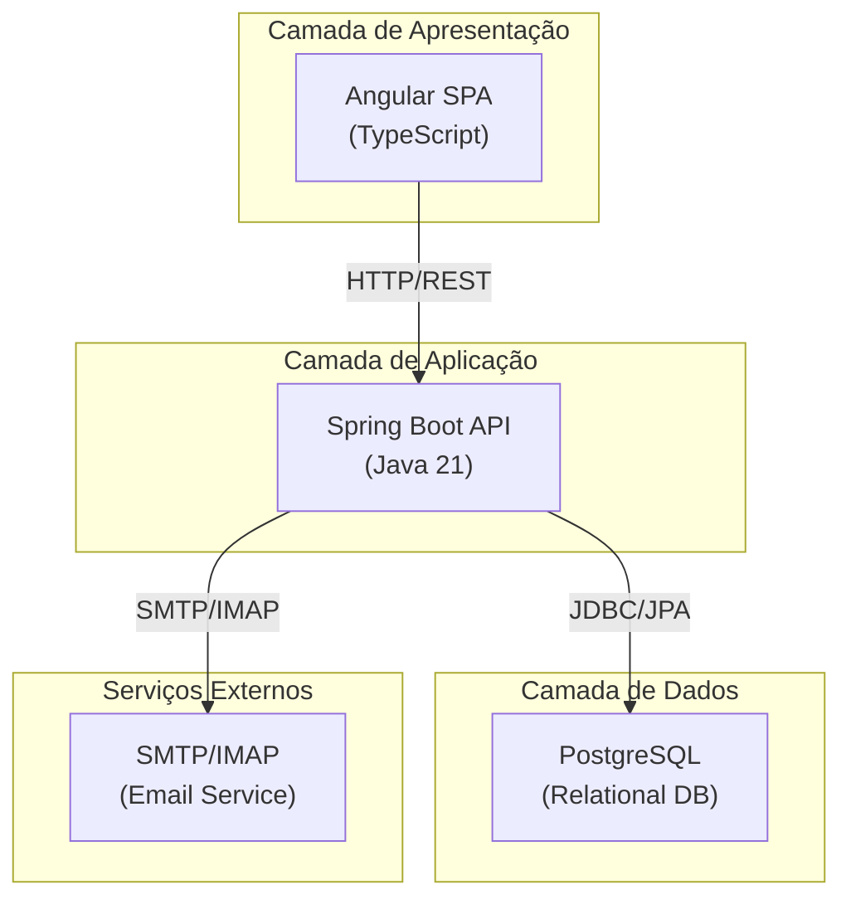
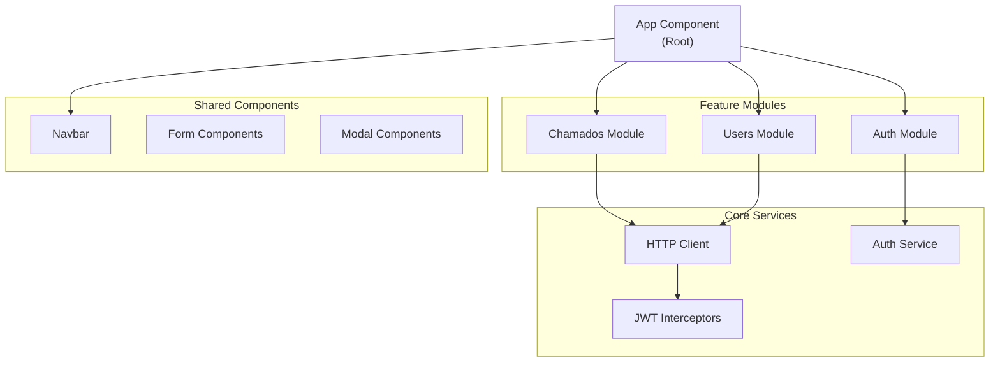
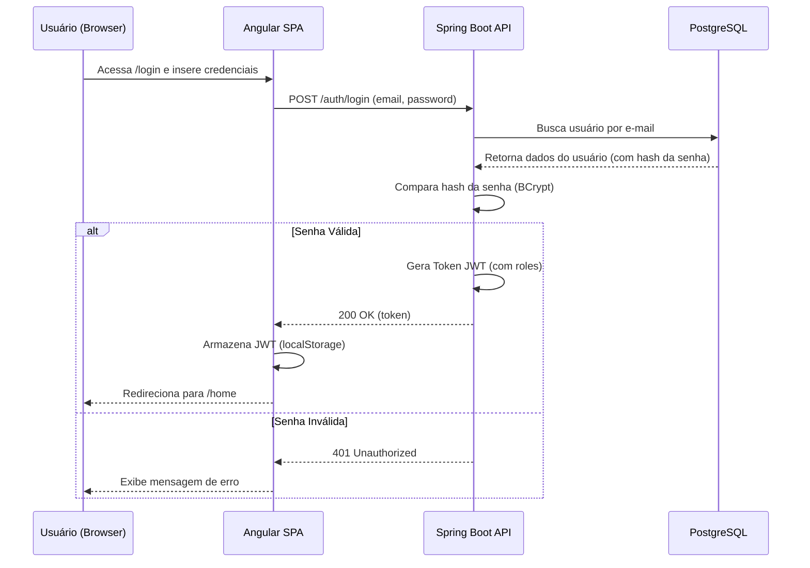
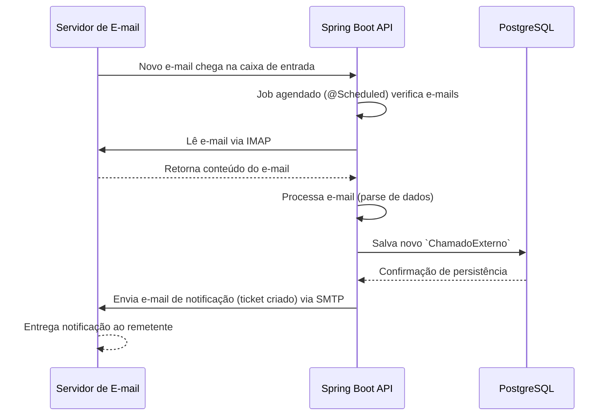
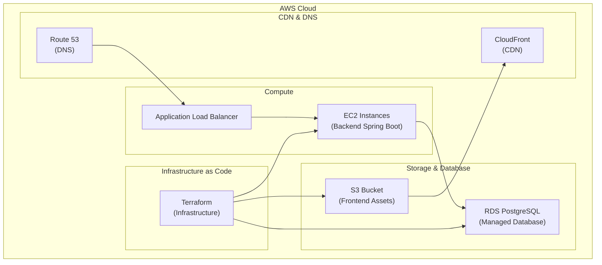
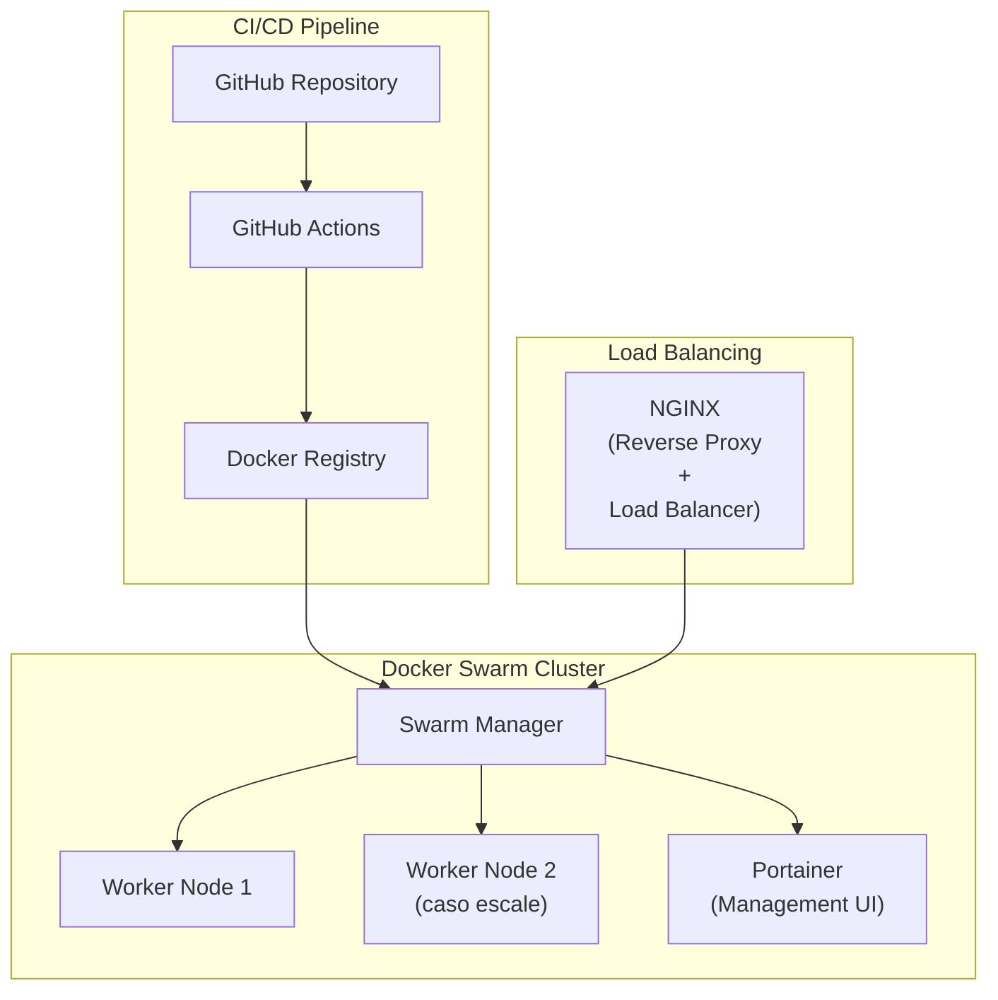
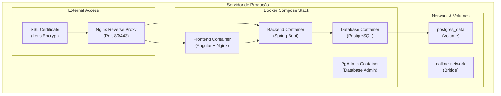
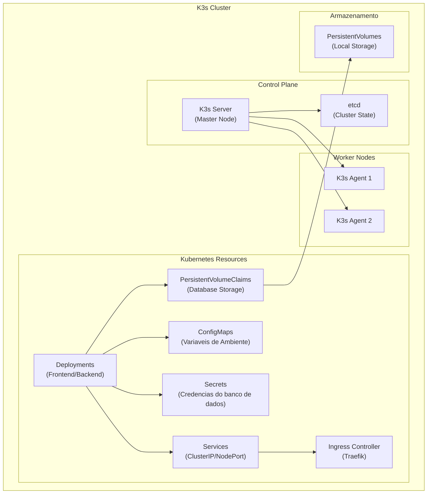
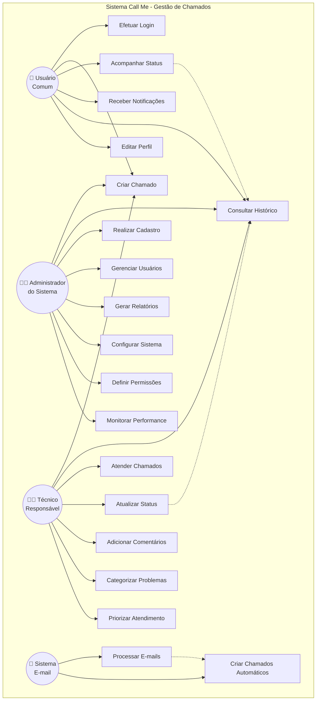

# Arquitetura de Sistema: Call Me
**Projeto de Engenharia de Software - IFMT Cuiabá**

**Disciplina:** Engenharia de Software

---

## Sumário

1. [Visão Geral e Objetivos](#1-visão-geral-e-objetivos)
    - [Objetivos Arquiteturais](#1-1-objetivos-arquiteturais)
2. [Arquitetura Geral do Sistema](#2-arquitetura-geral-do-sistema)
    - [Visão de Alto Nível](#2-1-Visão-de-Alto-Nível)
    - [Justificativa da Arquitetura Escolhida](#2-2-justificativa-da-Arquitetura-Escolhida)
3. [Arquitetura do Frontend](#3-arquitetura-do-frontend)
    - [Padrão Arquitetural: Component-Based Architecture com MVVM](#3-1-padrão-arquitetural-component-based-architecture-com-mvvm)
    - [Estrutura Detalhada do Frontend](#3-2-estrutura-detalhada-do-frontend)
    - [Diagrama da Arquitetura do Frontend](#3-3-diagrama-da-arquitetura-do-frontend)
4. [Arquitetura do Backend](#4-arquitetura-do-backend)
    - [Padrão Arquitetural: MVC (Model-View-Controller)](#4-1-padrão-arquitetural-mvc-model-view-controller)
    - [Estrutura Detalhada do Backend](#4-2-estrutura-detalhada-do-backend)
    - [Diagrama da Arquitetura do Backend](#4-3-diagrama-da-arquitetura-do-backend)
5. [Padrões de Comunicação](#5-padrões-de-comunicação)
6. [Fluxos Principais do Sistema](#6-fluxos-principais-do-sistema)
    - [Autenticação de Usuário](#6-1-autenticação-de-usuário)
    - [Criação de Chamado Externo via E-mail](#6-2-criação-de-chamado-externo-via-e-mail)
7. [Estratégias de Deploy](#7-estratégias-de-deploy)
    - [Estratégia 1: AWS com Terraform (Produção Cloud)](#7-1-estratégia-1-aws-com-terraform-produção-cloud)
    - [Estratégia 2: Docker Swarm + Portainer + GitHub Actions (Produção Self-Hosted)](#7-2-estratégia-2-docker-swarm-portainer-github-actions-produção-self-hosted)
    - [Estratégia 3: Docker Compose (Implementado)](#7-3-estratégia-3-docker-compose-implementado)
    - [Estratégia 4: Kubernetes com K3s (Kubernetes Lightweight)](#7-4-estratégia-4-kubernetes-com-k3s-kubernetes-lightweight)
8. [Aspectos de Segurança](#8-aspectos-de-segurança)
9. [Diagrama de Caso de Uso](#-diagrama-de-caso-de-uso)
10. [Principais Funcionalidades por Ator](#-principais-funcionalidades-por-ator)

---

## 1. Visão Geral e Objetivos

No **Call Me**, foi adotada uma **arquitetura em camadas**, desenvolvida como projeto acadêmico para demonstrar a aplicação prática de conceitos de Engenharia de Software. O sistema foi projetado com foco em **modularidade, manutenibilidade e separação de responsabilidades** entre apresentação, lógica de negócio e dados.

### 1.1. Objetivos Arquiteturais

- **Separação de Responsabilidades:** A independência entre frontend, backend e banco de dados foi garantida, facilitando manutenção e evolução.
- **Escalabilidade e Flexibilidade:** Cada serviço foi projetado para ser escalado ou substituído de forma independente, suportando diferentes cargas e cenários de uso.
- **Containerização e Portabilidade:** O uso de Docker garantiu ambientes idênticos em desenvolvimento, teste e produção, facilitando a integração inicial de novos membros e o deploy em múltiplas infraestruturas.
- **API RESTful Padronizada:** Padrões REST foram adotados para comunicação clara, desacoplada e documentada entre frontend e backend.
- **Segurança:** Autenticação robusta (JWT), controle de acesso por papéis e boas práticas de proteção de dados foram implementados desde o início do projeto.
- **Automação e DevOps:** A integração contínua e o deploy automatizado foram priorizados, reduzindo erros humanos e acelerando entregas.
- **Documentação e Transparência:** A documentação técnica (Insomnia, README) foi mantida sempre atualizada para facilitar colaboração e auditoria.

---

## 2. Arquitetura Geral do Sistema

### 2.1. Visão de Alto Nível


### 2.2. Justificativa da Arquitetura Escolhida

**Por que foi escolhida Arquitetura em Camadas?**
- **Separação Clara de Responsabilidades:** Frontend (apresentação), Backend (lógica de negócio) e Banco de dados foram bem definidos.
- **Desenvolvimento Paralelo:** As equipes puderam trabalhar simultaneamente em frontend, backend e devops.
- **Tecnologias Específicas:** Java Spring Boot foi utilizado no backend e Angular no frontend devido ao domínio prévio da equipe nessas tecnologias, o que reduziu a curva de aprendizado. O PostgreSQL foi adotado por ser o padrão visto na disciplina de banco de dados, garantindo experiência prévia de todos os membros.
- **Simplicidade para Escopo Acadêmico:** Arquitetura adequada ao tamanho e complexidade do projeto.
- **Facilidade de Manutenção:** Menor complexidade operacional comparado a microsserviços.

**Por que foi adotada Containerização?**
- **Ambiente Consistente:** Desenvolvimento, teste e produção idênticos.
- **Portabilidade:** Deploy em qualquer infraestrutura.
- **Isolamento:** Dependências não conflitantes.
- **Versionamento:** Controle preciso de versões de runtime

---

## 3. Arquitetura do Frontend

### 3.1. Padrão Arquitetural: Component-Based Architecture com MVVM

O frontend foi desenvolvido utilizando o Angular, que adota uma **arquitetura baseada em componentes** (Component-Based Architecture) para organizar a aplicação em unidades reutilizáveis e modulares. Além disso, o framework segue o padrão **Model-View-ViewModel (MVVM)**, onde os templates (View) interagem diretamente com os componentes (ViewModel), promovendo uma separação clara entre a interface do usuário e a lógica de apresentação.

### 3.2. Estrutura Detalhada do Frontend

A estrutura do frontend foi organizada de forma modular, conforme descrito abaixo:

```
src/
├── app/
│   ├── components/
│   ├── models/
│   ├── pages/
│   ├── security/
│   ├── services/
│   ├── statistics/
│   └── types/
├── assets/
├── favicon.ico
├── index.html
├── main.ts
├── styles/
│   └── variables.scss
└── styles.scss
```

### 3.3. Diagrama da Arquitetura do Frontend



---

## 4. Arquitetura do Backend

### 4.1. Padrão Arquitetural: MVC (Model-View-Controller)

O backend foi desenvolvido utilizando o Spring Boot, que segue o padrão **MVC (Model-View-Controller)** para organizar a aplicação. Esta arquitetura promove a separação clara entre as responsabilidades: **Controllers** gerenciam as requisições HTTP e respostas, **Models** (entidades de domínio) representam os dados e regras de negócio, e **Services** encapsulam a lógica de aplicação. O uso de **DTOs (Data Transfer Objects)** garante a transferência eficiente e segura de dados entre as camadas, enquanto os **Repositories** abstraem o acesso aos dados utilizando Spring Data JPA.

### 4.2. Estrutura Detalhada do Backend

A estrutura do backend foi organizada de forma modular, conforme descrito abaixo:

```
src/
├── main/
│   ├── java/
│   │   └── com/
│   │       └── example/
│   │           └── login_auth_api/
│   │               ├── controller/
│   │               ├── domain/
│   │               ├── dto/
│   │               ├── infra/
│   │               ├── repositories/
│   │               └── service/
│   └── resources/
│       ├── application.properties
│       ├── app.key
│       ├── app.pub
│       └── data.sql
└── test/
    └── java/
        └── com/
            └── example/
                └── login_auth_api/
```

### 4.3. Diagrama da Arquitetura do Backend

```mermaid
graph TD
    application["LoginAuthApiApplication<br>(Entry Point)"]

    subgraph "Controllers"
        auth_controller["AuthController"]
        user_controller["UserController"]
        chamado_externo_controller["ChamadoExternoController"]
        chamado_interno_controller["ChamadoInternoController"]
        email_receiver_controller["EmailReceiverController"]
        send_email_controller["SendEmailController"]
        password_reset_controller["PasswordResetController"]
        token_controller["TokenController"]
    end

    subgraph "Services"
        chamado_externo_service["ChamadoExternoService"]
        email_receiver_service["EmailReceiverService"]
        email_scheduler_service["EmailSchedulerService"]
        send_email_service["SendEmailService"]
        password_reset_service["PasswordResetService"]
        token_service["TokenService"]
        user_service["UserService"]
        auth_service["AuthService"]
        chamado_interno_service["ChamadoInternoService"]
    end

    application --> auth_controller
    application --> user_controller
    application --> chamado_externo_controller
    application --> chamado_interno_controller
    application --> email_receiver_controller
    application --> send_email_controller
    application --> password_reset_controller
    application --> token_controller

    auth_controller --> auth_service
    user_controller --> user_service
    chamado_externo_controller --> chamado_externo_service
    chamado_interno_controller --> chamado_interno_service
    email_receiver_controller --> email_receiver_service
    send_email_controller --> send_email_service
    password_reset_controller --> password_reset_service
    token_controller --> token_service
```



---


## 5. Padrões de Comunicação

- **Frontend ↔ Backend:** Foi implementada comunicação síncrona e sem estado, utilizando **HTTPS/REST** com payloads em formato **JSON**. O frontend atuou como cliente, consumindo os endpoints expostos pelo backend.
- **Backend ↔ Banco de Dados:** Foi configurada comunicação via **JDBC**, gerenciada pelo pool de conexões do Spring Boot e abstraída pelo ORM (Hibernate/JPA).
- **Backend ↔ Servidor de E-mail:** Foi implementada comunicação através dos protocolos padrão:
    - **IMAP** para leitura de e-mails (criação de chamados externos).
    - **SMTP** para envio de notificações.

---

## 6. Fluxos de Dados (Diagramas de Sequência)

### 6.1. Autenticação de Usuário


### 6.2. Criação de Chamado Externo via E-mail


---

## 7. Estratégias de Deploy

### 7.1. Estratégia 1: AWS com Terraform (Produção Cloud) `CARO`



**Vantagens:**
- **Managed Services:** RDS elimina administração de DB
- **Escalabilidade Automática:** Auto Scaling Groups
- **CDN Global:** CloudFront para performance
- **Infrastructure as Code:** Terraform para versionamento

### 7.2. Estratégia 2: Docker Swarm + Portainer + GitHub Actions `CUSTO-BENEFÍCIO`



**Vantagens:**
- **Self-Hosted:** Controle total da infraestrutura
- **CI/CD Integrado:** GitHub Actions automatizado
- **Interface Gráfica:** Portainer para gerenciamento
- **Load Balancing:** Traefik para distribuição

### 7.3. Estratégia 3: Docker Compose (Implementando) `SIMPLES`



**Fluxo de Deploy:**
1. **Preparação do Ambiente:** Configuração do servidor com Docker e Docker Compose
2. **Configuração de Rede:** Setup do reverse proxy Nginx para gerenciar SSL e roteamento
3. **Deploy da Stack:** Execução do `docker compose up -d` para subir todos os serviços
4. **Configuração SSL:** Integração com Let's Encrypt para certificados automáticos
5. **Monitoramento:** Setup de logs centralizados e health checks

**Vantagens:**
- **Simplicidade Operacional:** Gerenciamento direto via Docker Compose
- **Isolamento de Serviços:** Cada componente em container separado
- **Persistência de Dados:** Volumes Docker para PostgreSQL e PgAdmin
- **Facilidade de Backup:** Volumes centralizados facilitam backup dos dados

### 7.4. Estratégia 4: Kubernetes com K3s `COMPLICADA`



**Fluxo de Deploy:**
1. **Inicialização do Cluster:** Setup do K3s server e agents nos nós
2. **Configuração de Armazenamento:** Provisionamento de PersistentVolumes para PostgreSQL
3. **Deploy de Secrets:** Criação de secrets para credenciais do banco de dados
4. **Deploy de ConfigMaps:** Configuração de variáveis de ambiente
5. **Deploy do Database:** Deployment e Service do PostgreSQL com storage persistente
6. **Deploy do Backend:** Deployment e Service do Spring Boot conectado ao database
7. **Deploy do Frontend:** Deployment e Service do Angular
8. **Configuração de Ingress:** Setup do Traefik para roteamento HTTP/HTTPS com SSL automático

**Recursos Kubernetes:**
- **Deployments:** Gerenciamento declarativo dos containers (Descrever como a aplicação deve ser executada)
- **Services:** Descoberta de serviços e load balancing interno
- **Ingress:** Exposição externa com SSL/TLS automático via Let's Encrypt
- **PersistentVolumes:** Storage durável para dados do PostgreSQL
- **ConfigMaps/Secrets:** Gestão segura de configurações e credenciais
- **HorizontalPodAutoscaler:** Escalonamento automático baseado em CPU/memória

**Vantagens:**
- **Orquestração Nativa:** Gerenciamento automático de containers e recursos
- **Alta Disponibilidade:** Tolerância a falhas com múltiplos nós
- **Escalonamento Automático:** HPA para ajuste dinâmico de recursos
- **Rolling Updates:** Atualizações sem downtime
- **Service Discovery:** Comunicação automática entre serviços
- **Monitoramento Integrado:** Métricas e logs centralizados via Kubernetes API

---

## 8. Aspectos de Segurança

- **Autenticação:** Foi implementada baseada em JWT. O token foi enviado no cabeçalho `Authorization`.
- **Autorização:** Foi configurado o Spring Security para validar o JWT e as *roles* para controlar o acesso aos endpoints.
- **Segurança de Senhas:** As senhas foram armazenadas com hash **BCrypt**.

### 8.1. Limitações Críticas de Segurança

- **Gerenciamento de Segredos (Inseguro):** Foram utilizadas credenciais de banco de dados e outras chaves gerenciadas por variáveis de ambiente via `compose.yaml` e, pior, via `ConfigMap` nos manifestos Kubernetes. **Isto não foi seguro.** Para produção, seria **mandatório** migrar para **Kubernetes Secrets** ou uma solução de cofre (como HashiCorp Vault).
- **Comunicação em Texto Plano:** Foi configurada comunicação entre os contêineres e o acesso externo via HTTP, sem criptografia TLS/SSL. Em um ambiente de produção, seria essencial configurar um **Ingress Controller** no Kubernetes para gerenciar certificados TLS e forçar o uso de HTTPS.
- **CORS (Permissivo):** Foi configurado CORS no backend de forma permissiva para desenvolvimento. Em produção, deveria ser restrito apenas ao domínio do frontend.

---

## 9. Diagrama de Casos de Uso

O diagrama a seguir ilustra os principais atores do sistema Call Me e suas respectivas interações funcionais. Existem três perfis de usuário distintos, cada um com responsabilidades e permissões específicas dentro do fluxo de gestão de chamados:



### 9.1. Descrição dos Atores

- **👤 Usuário Comum:** Pessoa que utiliza o sistema para abrir, acompanhar e gerenciar seus próprios chamados de suporte.
- **👨‍💼 Administrador:** Responsável pela gestão geral do sistema, configurações, usuários e geração de relatórios.
- **👨‍🔧 Técnico:** Profissional responsável pelo atendimento, resolução e acompanhamento dos chamados abertos.
- **📧 Sistema E-mail:** Componente automatizado que processa e-mails recebidos para criação automática de chamados.


---

## 10. Funcionalidades Implementadas por Perfil de Usuário

### 10.1. 👨‍🔧 Responsável Técnico (Role: RT)

**Gestão de Conta:**
- Efetuar login seguro com autenticação JWT
- Recuperar senha através de token temporário enviado por e-mail
- Redefinir senha usando token de segurança

**Gestão de Chamados Internos:**
- Criar novos chamados internos através da interface web
- Visualizar chamados criados por si mesmo
- Receber notificações automáticas por e-mail sobre atualizações
- Ver chamados sob sua responsabilidade

### 10.2. 👨‍💼 Administrador (Role: ADMIN)

**Gestão de Usuários:**
- Cadastrar novos responsáveis técnicos (RT)
- Criar outros administradores do sistema
- Listar todos os responsáveis técnicos cadastrados
- Remover responsáveis técnicos do sistema
- Visualizar informações detalhadas dos responsáveis técnicos

**Acesso Ampliado:**
- Todas as funcionalidades de responsável técnico
- Acesso a endpoints protegidos com autorização específica

### 10.3. 🔄 Sistema Automatizado

**Processamento de E-mails:**
- Verificação automática da caixa de entrada de e-mail (a cada 1 minuto)
- Processamento de e-mails recebidos via protocolo IMAP
- Criação automática de chamados externos baseados nos e-mails
- Envio de notificações automáticas via SMTP
- Armazenamento de anexos de e-mail no banco de dados

**Funcionalidades de Suporte:**
- Geração automática de tokens JWT para autenticação
- Criptografia segura de senhas usando BCrypt
- Validação de permissões baseada em roles
- Logging e rastreamento de atividades do sistema