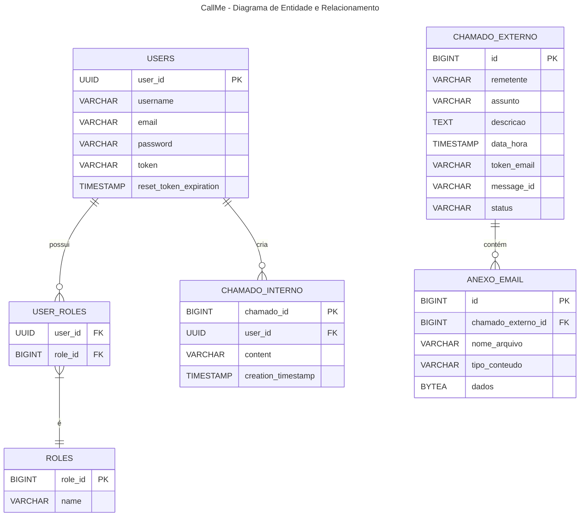

---

## Detalhamento dos Campos

### USERS
| Campo                   | Tipo      | Obrigatório | Valor Padrão           |
|-------------------------|-----------|-------------|------------------------|
| user_id (PK)            | UUID      | Sim         | Gerado automaticamente |
| username                | VARCHAR   | Sim         | -                      |
| email                   | VARCHAR   | Sim         | -                      |
| password                | VARCHAR   | Sim         | -                      |
| token                   | VARCHAR   | Não         | null                   |
| reset_token_expiration  | TIMESTAMP | Não         | null                   |

### ROLES
| Campo        | Tipo    | Obrigatório | Valor Padrão           |
|--------------|---------|-------------|------------------------|
| role_id (PK) | BIGINT  | Sim         | Gerado automaticamente |
| name         | VARCHAR | Sim         | -                      |

### USER_ROLES
| Campo      | Tipo   | Obrigatório | Valor Padrão |
|------------|--------|-------------|--------------|
| user_id FK | UUID   | Sim         | -            |
| role_id FK | BIGINT | Sim         | -            |

### CHAMADO_INTERNO
| Campo              | Tipo      | Obrigatório | Valor Padrão           |
|--------------------|-----------|-------------|------------------------|
| chamado_id (PK)    | BIGINT    | Sim         | Gerado automaticamente |
| user_id FK         | UUID      | Sim         | -                      |
| content            | VARCHAR   | Sim         | -                      |
| creation_timestamp | TIMESTAMP | Não         | NOW()                  |

### CHAMADO_EXTERNO
| Campo        | Tipo      | Obrigatório | Valor Padrão           |
|--------------|-----------|-------------|------------------------|
| id (PK)      | BIGINT    | Sim         | Gerado automaticamente |
| remetente    | VARCHAR   | Sim         | -                      |
| assunto      | VARCHAR   | Sim         | -                      |
| descricao    | TEXT      | Sim         | -                      |
| data_hora    | TIMESTAMP | Sim         | -                      |
| token_email  | VARCHAR   | Não         | null                   |
| message_id   | VARCHAR   | Não         | null                   |
| status       | VARCHAR   | Não         | 'ABERTO'               |

### ANEXO_EMAIL
| Campo                | Tipo   | Obrigatório | Valor Padrão           |
|----------------------|--------|-------------|------------------------|
| id (PK)              | BIGINT | Sim         | Gerado automaticamente |
| chamado_externo_idFK | BIGINT | Sim         | -                      |
| nome_arquivo         | VARCHAR| Sim         | -                      |
| tipo_conteudo        | VARCHAR| Sim         | -                      |
| dados                | BYTEA  | Sim         | -                      |
