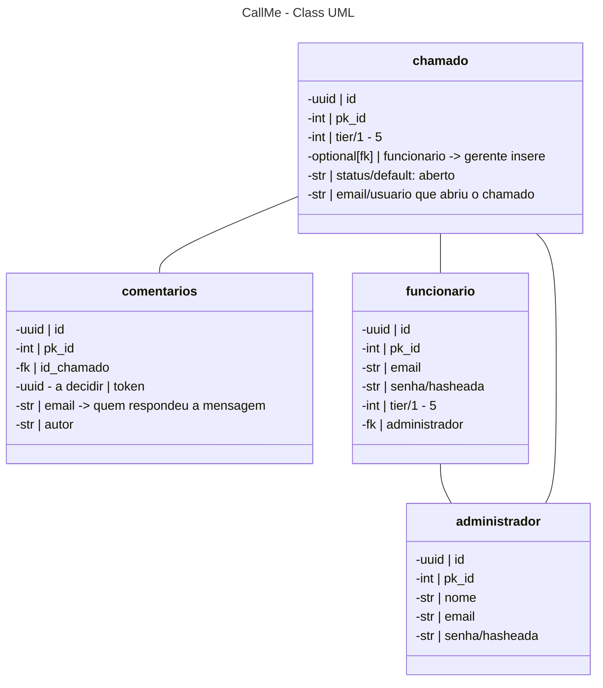

```mermaid
---
title: CallMe - Class UML
---
classDiagram
    chamado -- comentarios
    chamado -- funcionario
    funcionario -- administrador
    administrador -- chamado
    class comentarios{
        -uuid | id
        -int  | pk_id
        -fk | id_chamado
        -uuid - a decidir | token
        -str | email -> quem respondeu a mensagem
        -str | autor
    }
    class chamado{
        -uuid | id
        -int | pk_id
        -int | tier/1 - 5
        -optional[fk] | funcionario -> gerente insere
        -str | status/default: aberto
        -str | email/usuario que abriu o chamado
    }
    class funcionario{
        -uuid | id
        -int | pk_id
        -str | email
        -str | senha/hasheada
        -int | tier/1 - 5
        -fk | administrador
    }
    class administrador{
        -uuid | id
        -int | pk_id
        -str | nome
        -str | email
        -str | senha/hasheada
    }
```