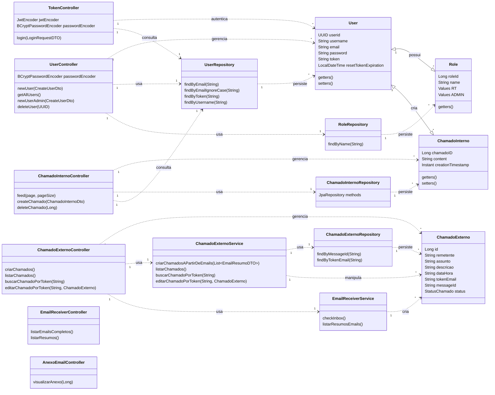
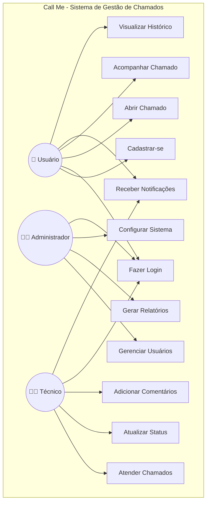

# Sistema de Gerenciamento de Chamados - Arquitetura

## Diagrama de Classes



## Dicionário de Dados

### Tabela: tb_users
| Campo | Tipo | Descrição |
|-------|------|-----------|
| user_id | UUID | Identificador único do usuário |
| username | VARCHAR | Nome de usuário (único) |
| email | VARCHAR | Email do usuário (único) |
| password | VARCHAR | Senha criptografada |
| token | VARCHAR | Token de autenticação |
| reset_token_expiration | TIMESTAMP | Data de expiração do token de reset |

### Tabela: tb_roles
| Campo | Tipo | Descrição |
|-------|------|-----------|
| role_id | BIGINT | Identificador único do papel |
| name | VARCHAR | Nome do papel (ADMIN ou RT) |

### Tabela: tb_users_roles (Relacionamento)
| Campo | Tipo | Descrição |
|-------|------|-----------|
| user_id | UUID | Referência ao ID do usuário |
| role_id | BIGINT | Referência ao ID do papel |

### Tabela: tb_chamados_internos
| Campo | Tipo | Descrição |
|-------|------|-----------|
| chamado_id | BIGINT | Identificador único do chamado |
| user_id | UUID | Referência ao usuário que criou o chamado |
| content | VARCHAR | Conteúdo do chamado |
| creation_timestamp | TIMESTAMP | Data e hora de criação do chamado |

## DTOs (Data Transfer Objects)

### CreateUserDto
- username: String
- password: String
- email: String

### LoginRequestDTO
- username: String
- password: String

### RegisterRequestDTO
- name: String
- email: String
- password: String
- setor: String

## Fluxo de Funcionamento

1. **Criação de Usuários**
   - ➡️ Usuários podem ser criados como RT (padrão) ou ADMIN
   - ➡️ Apenas ADMINs podem criar outros ADMINs
   - ➡️ Senhas são criptografadas usando BCrypt

2. **Autenticação**
   - ➡️ Login via username/password
   - ➡️ Geração de token JWT
   - ➡️ Sistema de reset de senha com token temporário

3. **Gerenciamento de Chamados**
   - ➡️ Usuários podem criar chamados internos
   - ➡️ Cada chamado está vinculado ao usuário criador
   - ➡️ Registro automático de timestamp de criação

4. **Controle de Acesso**
   - ➡️ Dois níveis de acesso: ADMIN e RT
   - ➡️ ADMINs podem gerenciar outros usuários
   - ➡️ Sistema de autorização baseado em roles 


# 📁 Estrutura do Projeto Call Me

## 📊 Diagrama de Caso de Uso

O diagrama abaixo representa os principais atores e suas interações com o sistema Call Me:



## 🏗️ Estrutura do Projeto

### 📂 Backend (Java + Spring Boot)

```
callme_backend/
├── login-auth-api/
│   ├── src/
│   │   ├── main/
│   │   │   ├── java/
│   │   │   │   └── com/
│   │   │   │       └── callme/
│   │   │   │           ├── config/
│   │   │   │           ├── controller/
│   │   │   │           ├── dto/
│   │   │   │           ├── model/
│   │   │   │           ├── repository/
│   │   │   │           ├── service/
│   │   │   │           └── security/
│   │   │   └── resources/
│   │   └── test/
│   └── pom.xml
└── .gitignore
```

### 📂 Frontend (Angular)

```
callme_frontend/
├── angular-frontend/
│   ├── src/
│   │   ├── app/
│   │   │   ├── components/
│   │   │   ├── services/
│   │   │   ├── models/
│   │   │   ├── guards/
│   │   │   └── shared/
│   │   ├── assets/
│   │   └── environments/
│   ├── package.json
│   └── angular.json
└── package-lock.json
```

## 🎯 Principais Funcionalidades por Ator

### 👤 Usuário Comum
- Cadastro e login no sistema
- Abertura de novos chamados
- Acompanhamento do status dos chamados
- Recebimento de notificações
- Visualização do histórico de chamados
- Atualização de dados pessoais

### 👨‍💼 Administrador
- Gerenciamento de usuários
- Geração de relatórios
- Configurações do sistema
- Monitoramento geral
- Definição de políticas de acesso

### 👨‍🔧 Técnico
- Atendimento aos chamados
- Atualização de status
- Adição de comentários e soluções
- Categorização de problemas
- Priorização de atendimentos

## 🔧 Tecnologias Utilizadas

### Backend
- Java 21
- Spring Boot 3
- Spring Security
- JWT Authentication
- PostgreSQL
- JPA/Hibernate
- Maven

### Frontend
- Angular 17+
- TypeScript
- Angular Material
- RxJS
- SCSS
- JWT Interceptor

### DevOps
- Docker
- Docker Compose
- Git
- GitHub Actions (CI/CD)

## 📡 Integrações

- Sistema de E-mail para notificações
- Autenticação JWT
- Banco de dados PostgreSQL
- Upload de arquivos
- Logs do sistema 
